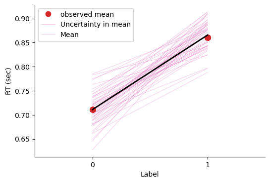
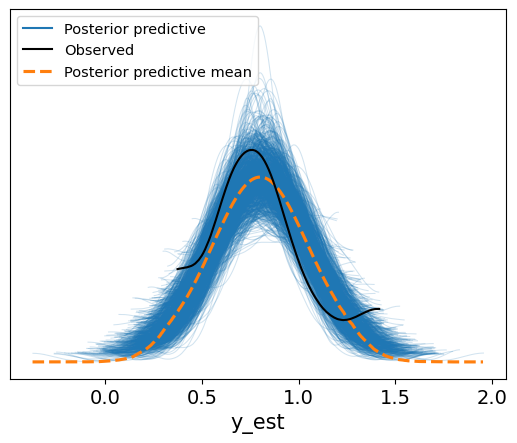

# 模型拟合  

## 模型定义  

现在，我们可以结合数据与先验，为参数$(\beta_0, \beta_1, \sigma)$生成后验模型  

* 之后我们可以使用 PyMC 来完成对于模型后验分布的采样过程  

在这之前，我们回顾之前对先验与似然的定义：  

**先验（prior）**  

- $\beta_{0}   \sim N\left(5, 2^2 \right)$  

  * 模型的截距项服从均值为 5，标准差为 2 的正态分布。  

- $\beta_1   \sim N\left(0, 1^2 \right)$  

  * 模型的斜率项，服从均值为 0，标准差为 1 的正态分布。  

- $\sigma   \sim \text{Exp}(0.3)$  

  * 代表误差项的标准差，服从参数为 0.3 的指数分布。  

**似然（likelihood）**  

- $\mu_i = \beta_0 + \beta_1X_i$  

- $Y_i {\sim} N\left(\mu_i, \sigma^2\right)$  

在建立模型时，我们使用了刚才讨论的先验分布和似然函数。具体来说，$β_0$采用正态分布，均值为5，标准差为2；$β_1$使用均值为0，标准差为1的正态分布；$σ$则采用参数为0.3的指数分布。通过这些设置，模型的先验部分就定义完成了。

接下来，我们将这些内容转化为代码。代码的编写其实非常简单，尤其是对于正态分布部分，大家在使用PyMC库时已经相当熟悉了。具体实现时，首先定义先验的分布，并为每个参数命名，比如$β_0、β_1和σ$。之后，我们将自变量X定义为数据集中的对应列。

```python
import pymc as pm

with pm.Model() as linear_model:

    # 定义先验分布参数
    beta_0 = pm.Normal("beta_0", mu=5, sigma=2)        
    beta_1 = pm.Normal("beta_1", mu=0, sigma=1)      
    sigma = pm.Exponential("sigma", 3)                    

    # 定义自变量 x
    x = pm.MutableData("x", df['Label'])         

    # 定义 mu，将自变量与先验结合
    mu = beta_0 + beta_1 * x

    # 定义似然：预测值y符合N(mu, sigma)分布
    likelihood = pm.Normal("y_est", mu=mu, sigma=sigma, observed=df['RT_sec'])  # 实际观测数据 y 是 RT
```
在将数据提取出来后，实际上我们只有两个变量：`label` 和 `RT_sec`。接下来，我们根据前面讨论的公式将这两个变量组合起来。

接下来，我们需要将似然函数（likelihood）定义出来。在PyMC中，我们使用 `pm.Normal` 来表示正态分布的似然，其中 `y_est` 代表预测值。对于正态分布而言，参数包括均值 $μ$ 和标准差 $σ$，因此我们需要将这些参数作为输入。

定义似然函数时，我们的模型会与实际数据进行组合。通过将数据与模型相结合，我们得到了最终的模型形式。在代码中，y_est 表示基于当前参数（即 `μ` 和 `σ`）计算出来的预测值，而我们通过 `observe` 来对比模型预测与实际观察到的数据。


## 后验采样  

1. 接下来我们使用`pm.sample()`进行mcmc采样  

* 我们指定了4条马尔科夫链，保留的采样数为5000，对于每一个参数，在每条链上都有5000个采样结果  

  * $\left\lbrace \beta_0^{(1)}, \beta_0^{(2)}, \ldots, \beta_0^{(5000)} \right\rbrace$  

  * $\left\lbrace \beta_1^{(1)}, \beta_1^{(2)}, \ldots, \beta_1^{(5000)} \right\rbrace$  

  * $\left\lbrace \sigma_1^{(1)}, \sigma_1^{(2)}, \ldots, \sigma_1^{(5000)} \right\rbrace$  

接下来，我们使用 `PyMC` 的 `sample` 方法进行后验采样。通常，设置四条 MCMC 链 `(chains=4) `和 5000 次采样` (draws=5000) `。
```python

# ===========================

# 注意！！！以下代码可能需要运行1-2分钟左右

# ===========================
with linear_model:
    trace = pm.sample(draws=5000,                   # 使用mcmc方法进行采样，draws为采样次数
                      tune=1000,                    # tune为调整采样策略的次数，可以决定这些结果是否要被保留
                      chains=4,                     # 链数
                      discard_tuned_samples=True,  # tune的结果将在采样结束后被丢弃
                      random_seed=84735)

```

```
Auto-assigning NUTS sampler...
Initializing NUTS using jitter+adapt_diag...
Multiprocess sampling (4 chains in 4 jobs)
NUTS: [beta_0, beta_1, sigma]
```
```
output()
```
```
Sampling 4 chains for 1_000 tune and 5_000 draw iterations (4_000 + 20_000 draws total) took 5 seconds.
```

在构建模型时，我们通过 `trace` 保存 MCMC 采样的结果。在运行 `PyMC` 时，通常会设置 `5000` 次采样，并指定 `tune` 来进行热身（warm-up），然后设置 `chains=4` 表示使用四条链进行采样。此外，我们还会丢弃热身阶段的样本，并指定 `random_seed` 确保结果的可复现性。完成后，我们将获得一个 `trace`，该 `trace` 包含了所有采样的结果。

在前一节课中，我们讨论了如何从 `trace` 中提取各种信息。这里涉及的关键数据结构是 `inference data`，它使用 `xarray `格式来保存 MCMC 采样的结果。这种数据结构便于存储和操作采样数据，从中提取后验分布、参数估计值及其不确定性等重要信息。


2. 在采样结束之后，我们得到采样样本 trace  

* 后验样本储存在`trace.posterior`中，它的数据类型为 xarray。  

  * 包括了两个维度(索引)，第一个维度为链chain，第二个维度为采样draw  
  
  * 包含了3个变量，即3个参数beta_0, beta_1, sigma  

    * 我们可以使用 `trace.posterior['beta_0']`提取后验中的$\beta_0$参数  

    * 我们可以使用 `trace.posterior['beta_0'][0, 10]`提取$\beta_0$第一条链中第10个采样值

**补充 ArviZ inferenceData 介绍**  

`trace` 中的 `inferenceData` 是 PyMC 中用来存储和管理采样结果的格式，专门用于便于分析和可视化。它采用 `ArviZ` 的 `InferenceData` 对象进行封装，包含了多个维度的数据集合，用于存储模型的采样结果、样本统计、后验预测等。以下是 `trace` 中 `inferenceData` 的典型结构和内容：  

1. `posterior`  
`posterior` 是 `InferenceData` 中最核心的一个组，包含了每条链和每次采样的后验分布样本。对于本例子中的模型，`posterior` 包括以下参数：  

* `beta_0`: 表示截距参数的后验分布采样值。  
* `beta_1`: 表示斜率参数的后验分布采样值。  
* `sigma`: 表示残差标准差的后验分布采样值。  

数据结构通常为 `(chain, draw, parameter)`，其中 `chain` 表示不同的链，`draw` 是每条链的样本数量。我们可以用 `posterior` 中的数据来绘制各个参数的后验分布图，分析它们的均值、中位数及不确定性。  

2. `sample_stats`  
`sample_stats` 存储每次采样的统计信息，帮助评估采样质量。这些数据有助于诊断 MCMC 链的收敛性和性能。常见的统计信息包括：  

* `lp`: 对数后验密度 (log-posterior)，用于评估样本的相对“好坏”。  
* `r_hat`: 用于评估链的收敛情况，理想值接近1，若远离1可能表明链未收敛。  
* `ess_bulk` 和 `ess_tail`: 分别为整体和尾部的有效样本数，用于衡量采样的独立性。  
* `diverging`: 若存在divergence，通常表明模型的特定区域无法很好地被估计。  

这些统计信息可以用于诊断和调整模型的采样参数，比如增大 `tune` 或 `draws` 的数量。  

3. `observed_data`  
`observed_data` 包含实际的观测数据，这在本例中为 `df['RT_sec']`。在模型的 `likelihood` 部分指定了 `observed=df['RT_sec']`，因此它也会被存储到 `inferenceData` 中，便于对比观测值和预测值。  

1. `posterior_predictive`  
如果在模型中使用 `pm.sample_posterior_predictive` 来生成后验预测分布，这些预测值会存储在 `posterior_predictive` 中。`posterior_predictive` 包含每条链和每次采样生成的预测值（`y_est`），方便与观测数据（`observed_data`）进行对比，评估模型的预测效果和拟合度。  

1. `prior`  
若通过 `pm.sample_prior_predictive` 生成了先验预测分布，`prior` 会保存这些值。它能帮助我们了解模型在没有观测数据时的先验分布，为参数的选择提供参考。  

<div style="padding-bottom: 30px;"></div>

在运行完采样（sampling）之后，得到的结果是一个trace数据，这个数据通常是交互式的，尤其是在Jupyter Notebook环境中。Jupyter提供了可视化功能，帮助用户更好地理解数据。但在纯代码环境中，这种交互式功能就无法实现，因此需要注意保存和读取操作。

Trace数据通常包含模型的后验分布信息以及观测数据。没有进行采样时，模型并没有后验数据。定义了模型并加入数据后，才会生成相应的观测数据。在这种情况下，trace数据被存储为inference data格式，这通常是一个xarray格式的数据集（dataset）

>💡数据演示见课件

**trace**

在PyMC中，trace数据的格式称为inference data，这种格式是多维的，能够有效存储模型的各类信息，尤其是采样后的后验分布结果。inference data包含了两个重要概念：维度和坐标。

维度定义了模型中变量的特征，例如反应时（RT）等。如果模型包含多个变量（如反应时、决策时间或EEG数据），每个变量都可以有不同的维度。例如，可能有105个维度对应105个数据点。
坐标用于指定每个维度的索引。坐标值可以是数字（如0, 1, 2...104），也可以是字符串（如学校名称），以便于更清晰地标识和索引数据。

通过维度和坐标的结合，inference data允许我们处理多维数据，甚至在变量之间进行索引和提取。每个索引对应一个数据值。例如，在模型中，反应时的数据会根据相应的维度坐标来展示。

在Jupyter Notebook中，inference data的显示是交互式的，可以方便地展开查看各个数据变量。当没有采样结果时，数据结构只包含观测变量。当进行后验采样后，inference data会新增一个“后验”组，包含后验分布的维度和坐标，以及与之对应的采样值。


**trace.posterior**
trace.posterior['beta_0']
trace.posterior['beta_0'][0, 10]

inference data 中的 group 名称是**固定**的，这样的设计有其优势和局限性。其主要优点在于统一性和简化操作。当进行贝叶斯分析时，常见的几个 group 名称通常会被使用，最常用的就是 posterior 和 posterior predictive，它们在不同的贝叶斯模型中会始终保持一致。例如：

- **Posterior：**这是贝叶斯分析中最常用的数据，通常是我们关注的重点。我们会基于后验分布对模型参数进行分析，包括提取数据、绘图等操作。
- **Posterior Predictive：**这是基于后验分布进行预测的结果，通常用于模型的评估和检验，或者生成对比不同模型的预测。

固定的 group 名称帮助用户熟悉和简化操作流程，因为不论使用何种贝叶斯模型，这些 group 名称都是一致的，避免了每次使用时重新定义。这种命名方式的好处是它使得贝叶斯分析中的数据处理更加一致和方便，尤其是在进行模型比较时。

不过，这种固定命名方式也有局限性，因为我们无法随意更改这些 group 的名称。如果有特定需求需要重新定义或修改某些数据结构的名称，可能会受到限制。尽管如此，一旦理解了这些常用 group 的含义，使用起来就会变得更加顺手和高效。

## MCMC 诊断  

使用`az.plot_trace()`可视化参数的后验分布
```python
import arviz as az

ax = az.plot_trace(trace, figsize=(7, 7),compact=False,legend=True)
plt.tight_layout()
plt.show()
```


从图中可以清晰地观察到，每条链使用不同的颜色区分。对于诊断，我们重点关注链条是否充分混合。若如图所示，不同链条的轨迹完全混合在一起，且从不同起点出发后最终表现出类似的分布，这说明采样质量较高，链条运行良好。

对于模型的诊断信息 ess_bulk 和 r_hat (当然你可以结合可视化进行诊断)。  
* 其中，各参数的 r_hat 均接近于 1；  
* 各参数的ess_bulk 均大于 400，并且有效样本量占比 (6000/20000)=0.3，大于0.1(即10%)。 

```python 
az.summary(trace, kind="diagnostics")
```
<div>
<style scoped>
    .dataframe tbody tr th:only-of-type {
        vertical-align: middle;
    }

    .dataframe tbody tr th {
        vertical-align: top;
    }

    .dataframe thead th {
        text-align: right;
    }
</style>
<table border="1" class="dataframe">
  <thead>
    <tr style="text-align: right;">
      <th></th>
      <th>mcse_mean</th>
      <th>mcse_sd</th>
      <th>ess_bulk</th>
      <th>ess_tail</th>
      <th>r_hat</th>
    </tr>
  </thead>
  <tbody>
    <tr>
      <th>beta_0</th>
      <td>0.0</td>
      <td>0.0</td>
      <td>10224.0</td>
      <td>11211.0</td>
      <td>1.0</td>
    </tr>
    <tr>
      <th>beta_1</th>
      <td>0.0</td>
      <td>0.0</td>
      <td>10341.0</td>
      <td>11605.0</td>
      <td>1.0</td>
    </tr>
    <tr>
      <th>sigma</th>
      <td>0.0</td>
      <td>0.0</td>
      <td>11501.0</td>
      <td>11301.0</td>
      <td>1.0</td>
    </tr>
  </tbody>
</table>
</div>


除了可视化诊断外，我们还可以通过量化指标对 MCMC 的结果进行评估，例如有效样本量（ESS）和 R-hat 指标。这同样可以通过一行代码完成，即使用 `az.summary(trace)` 函数。若仅关注诊断信息，可以通过设置 `kind="diagnostics"` 参数，使输出更简洁，专注于相关指标。

从结果中可以看到，R-hat 指标接近 1，这是链条充分混合、收敛性良好的标志。同时，ESS 指标也很高（如 10000+），说明有效样本量充足，采样结果具有较高的信赖度。这表明我们的后验分布和 MCMC 链的质量较高。

需要注意的是，由于模型较为简单，即使将采样次数减少到 2000 次，可能仍然能够得到类似的高质量结果。简单模型通常更容易快速达到收敛。

## 后验预测  

在确认 MCMC 采样结果可靠后，下一步需要检验模型与数据的匹配程度。之前我们评估的是参数估计的稳定性，即 MCMC 链是否收敛；但模型是否适合数据尚未验证。**这一步的目标是判断模型对数据的拟合效果是否良好。**

MCMC 诊断仅能显示采样过程的收敛性和采样质量，而不能直接说明模型在观测数据上的拟合效果或预测能力。**为评估模型的预测能力，我们可以进行后验预测检查，通过模拟新的数据样本来比较模型生成的数据与实际观测数据的分布是否一致，从而验证模型的合理性和适用性。**  

* 为了更全面地反映模型的不确定性，我们可以基于 20000 对参数值生成 20000 条回归线。  

* 这些回归线将展示在 "self" 和 "other" 条件下的预测差异，以及模型在不同参数样本下的预测范围。这种基于后验参数的预测被称为后验预测 (Posterior Prediction)。  

* 在进行后验预测时，我们利用模型后验采样得到的参数进行预测，并结合真实数据生成预测值的分布。  
* 这个过程不仅可以帮助我们检查模型对数据的适配度，还能通过可视化展现预测的不确定性。

**一个好的模型，其核心特征在于与数据的拟合程度良好**。模型根据观测数据估计出的参数，应该能够生成与实际观测数据高度相似的新数据。如果新生成的数据在分布、趋势等方面与原始观测数据非常一致，或者误差极小，就可以认为模型与数据之间的匹配是令人满意的。

在模型匹配评估中，有一种**非常直观且符合逻辑的方式**：首先，根据观测数据拟合出模型并得到参数的后验分布；然后，利用这些后验分布的参数生成模拟数据；最后，将生成的数据与原始观测数据进行对比，观察二者在特性上的相似性。如果生成的数据能够很好地再现原始数据的特性，就说明模型与数据的拟合效果较好。

**后验预测(Posterior Predictive Check)正是完成这一任务的重要步骤**。在完成后验采样并确认 MCMC 链的收敛性和采样质量之后，仍需通过后验预测进一步验证模型的合理性。具体而言，通过 MCMC 采样获得的后验分布，我们可以提取大量的参数组合，用以生成模拟数据。例如，假设有 2 万组后验参数组合，这相当于生成了 2 万条回归线。这些回归线是否能够捕捉到观测数据中的特性，例如变量间的差异，是模型是否合理的重要评估标准。

### 🎯练习  

根据 **先验预测检验可视化预测结果**的思路，对于后验预测结果进行可视化。  

1. 使用真实数据中的自变量Label  
2. 根据 20000对参数（beta_0, beta_1），与自变量(Label)进行组合，生成了20000条回归线  
3. 绘制后验预测结果  

```python
# 通过np.arange设置 x 轴代表 Label，其中 0 代表 Self， 1代表other

x_sim = np.array([0, 1])

# 选取一组参数来作为预测

beta_0 = trace.posterior["beta_0"].stack(sample=("chain", "draw"))[:2]
beta_1 = trace.posterior["beta_1"].stack(sample=("chain", "draw"))[:2]

# 生成20000条回归线

y_sim_re = beta_0 + beta_1 * x_sim

# 绘制真实数据的散点图

plt.scatter(trace.constant_data.x, trace.observed_data.y_est,c="r", label="observed data")

# 绘制回归线条

plt.plot(x_sim, y_sim_re, c="grey", label = "Predicted Mean")
plt.scatter(x_sim, y_sim_re, color="black", s=50)

# 设置标题等

plt.xlim(-0.5, 1.5)
plt.xticks([0, 1])
plt.title("posterior predictive check")
plt.xlabel("Label")
plt.ylabel("RT (sec)")  
plt.legend()
sns.despine()

```


在后验预测中，我们绘制的数据实际上是预测值的均值。这与线性回归中的概念类似，即模型预测的是在某个特定自变量$X$取值时，因变量$Y$的期望均值。实际观测的数据通常会围绕这个均值上下波动。绘图中，黑色点显示了预测的均值，实际数据的分布则展现了围绕均值的波动特征。

**使用`plot_lm` 绘制后验预测的线性模型**  

**代码详解**  

* 与上一段代码最大的不同之处在于，此时需要将`y_model` 存入`trace`中  

* 在`az.plot_lm`中:  
  * `y` 为真实数据中的因变量`df.RT_sec`  
  * `x` 为真实数据中的自变量`df.Label`  
  * `y_model` 为结合后验采样生成的预测值  
    （在图中表示为黄色和灰色的回归线）  

> 😎*跑起来快很多*


```python
import xarray as xr

# 导入真实的自变量

x_value = xr.DataArray(df.Label)

# 基于后验参数生成y_model

trace.posterior["y_model"] = trace.posterior["beta_0"] + trace.posterior["beta_1"] * x_value
df['Mean RT'] = df.groupby['Label']('RT_sec').transform('mean')

# 绘制后验预测线性模型

az.plot_lm(
           y= df['Mean RT'],
           x= df.Label,
           y_model = trace.posterior["y_model"],
           y_model_mean_kwargs={"color":"black", "linewidth":2},
           figsize=(6,4),
           textsize=16,
           grid=False)

# 设置坐标轴标题、字体大小

plt.xlim(-0.5, 1.5)
plt.xticks([0, 1])
plt.xlabel('Label')  
plt.ylabel('RT (sec)')  
plt.legend(['observed mean', 'Uncertainty in mean', 'Mean'])

sns.despine()
```



在后验预测中，如果我们绘制真实数据的均值，就能更直观地观察预测的合理性。通过对比实际观测均值和预测均值，可以发现预测结果通常较为贴合实际数据分布。同时，每一组MCMC采样参数都可以生成一组预测，因此理论上可以产生大量预测进行比较。

绘图中的预测均值相当于正态分布中的$μ$，每条线代表不同自变量$X$取值（如$X=0$ 和 $X=1$）时的预测均值。此外，基于这些预测均值$μ$和观测数据中相应的标准差$σ$，我们还可以生成模拟的随机观测数据（如反应时）。

### 通过MCMC采样值理解后验预测分布  

* 通过MCMC采样，三个参数各获得了20000个采样值$\left(\beta_0^{(i)},\beta_1^{(i)},\sigma^{(i)}\right)$  

* 根据 20000 组参数值 $\beta_0$ 和 $\beta_1$，可以得到 20000 个均值 $\mu$ 的可能值。然后再根据 $\mu$ 生成预测值 $Y_{\text{new}}$。  
* 20000 个均值 $\mu$ 构成了预测的均值分布：  

$$  
\left[  
\begin{array}{ll}  
\beta_0^{(1)} & \beta_1^{(1)} \\  
\beta_0^{(2)} & \beta_1^{(2)} \\  
\vdots & \vdots \\  
\beta_0^{(20000)} & \beta_1^{(20000)} \\  
\end{array}  
\right]  
\;\; \longrightarrow \;\;  
\left[  
\begin{array}{l}  
\mu^{(1)} \\  
\mu^{(2)} \\  
\vdots \\  
\mu^{(20000)} \\  
\end{array}  
\right]  
$$  

* 为了模拟这个过程，我们首先从后验分布中提取采样结果，并生成每个采样值对应的预测均值 $\mu$。每个均值 $\mu^{(i)}$ 可以通过以下公式计算：  

$$  
\mu^{(i)} = \beta_0^{(i)} + \beta_1^{(i)} X  
$$  

* 然后，在每个均值 $\mu^{(i)}$ 的基础上，加入噪声项 $\epsilon$ 来生成 $Y_{\text{new}}^{(i)}$：  

$$  
Y_{\text{new}}^{(i)} = \mu^{(i)} + \epsilon^{(i)}, \quad \epsilon^{(i)} \sim \mathcal{N}(0, \sigma^{(i)})  
$$  

* 这里，$\epsilon^{(i)}$ 是服从均值为 0，方差为 $\sigma^{(i)}$ 的正态分布。  

> 可以注意到，生成的预测值受到两种变异的影响：  
>
> * 一是参数估计的不确定性（即 $\beta_0$ 和 $\beta_1$ 的后验分布带来的变异），导致不同样本的均值 $\mu$ 具有差异；  
> * 二是随机误差项 $\epsilon$ 的影响，使得在相同均值 $\mu$ 下生成的预测值 $Y_{\text{new}}$ 仍然存在随机波动。这两种变异共同决定了最终预测值的后验预测分布。  

<div style="padding-bottom: 30px;"></div>

在MCMC采样或贝叶斯统计中，我们可以通过采样得到的2万组参数来生成预测值。例如，对于每组参数$\beta_0$、$\beta_1$，结合实际数据中的$X_i$值，通过公式$\beta_0 + \beta_1 · X$，就可以计算出一系列预测均值。这些预测均值实际上构成了一个完整的回归模型，是参数和数据的线性组合。

同时，从采样结果中也可以提取对应的$σ$值，与这些均值配合，用来表征预测分布的波动范围。这种方式让我们能够更精确地构建每组采样参数下的预测分布，进一步检验模型对数据的拟合程度。

### 提取后验样本并生成预测  

**我们也可以用代码来进行模拟，首先我们先进行单次完整的抽取过程**

```python

# 采样得到的参数后验分布都储存在 trace.posterior中，我们进行一些提取操作

pos_sample = trace.posterior.stack(sample=("chain", "draw"))

# 将每个参数的20000次采样结果存储在数据框中

df_pos_sample = pd.DataFrame({"beta_0": pos_sample["beta_0"].values,
                              "beta_1": pos_sample["beta_1"].values,
                              "sigma": pos_sample["sigma"].values})

# 查看参数

df_pos_sample
```


```python
# 抽取第一组参数组合，生成正态分布的均值

row_i = 0  
X_i = 1
mu_i = df_pos_sample.beta_0[row_i] + df_pos_sample.beta_1[row_i] * X_i
sigma_i = df_pos_sample.sigma[row_i]

# 从正态分布中随机抽取一个值，作为预测值

prediction_i = np.random.normal(
                                loc = mu_i,
                                scale= sigma_i,
                                size=1)

# 你可以运行该代码块多次，比较在相同参数下，预测值的变化(感受采样变异)

print(f"mu_i: {mu_i:.2f}, 预测值：{prediction_i[0]:.2f}")
```
`
mu_i: 0.91, 预测值：1.12
`

在贝叶斯统计或MCMC中，通过采样得到的每组参数（如$\mu$和$\sigma$）用于生成预测数据。对于每一个给定的$X$值，我们可以计算出对应的$\mu$和$\sigma$，然后从正态分布中随机采样，得到一个预测的反应时间或观测数据。这个预测值是基于当前参数（$\mu$ 和 $\sigma$）从分布中抽取的随机样本。

通过这种方式，我们可以进行多次采样。例如，对于每一组$\mu$和$\sigma$，我们可以进行多个观测值的生成。假如每组$\mu$和$\sigma$生成5个观测值，经过2万个参数组合的迭代，我们将生成10万个模拟数据。这些模拟数据可以与实际的观测数据进行比较，从而评估模型预测的准确性和数据拟合的程度。


**使用代码模拟多次后验预测**  

* 通过上述四行代码，我们已经进行了一次完整的后验预测  

* 我们可以写一个循环，重复这个过程20000次  

* 最后的结果中，每一行代表一个参数对；mu 为预测的均值，y_new 为实际生成的预测值。
```python
# 生成两个空列，用来储存每一次生成的均值mu，和每一次抽取的预测值y_new

df_pos_sample['mu'] = np.nan
df_pos_sample['y_new'] = np.nan
X_i = 1
np.random.seed(84735)

# 将之前的操作重复20000次

for row_i in range(len(df_pos_sample)):
    mu_i = df_pos_sample.beta_0[row_i] + df_pos_sample.beta_1[row_i] * X_i
    df_pos_sample["mu"][row_i] = mu_i
    df_pos_sample["y_new"][row_i] = np.random.normal(loc = mu_i,
                                            scale= df_pos_sample.sigma[row_i],
                                            size=1)
df_pos_sample
```


**绘制后验预测分布**  

根据刚刚生成的数据，我们可以分别绘制出 $\mu$ 与 $Y_{new}$ 的后验预测分布图
```python
# 查看真实数据中的取值，与后验预测分布作对比
df2 = df.drop(["Mean RT"],axis=1).copy()
print("x=1时y的取值有:", np.array(df2[df2["Label"]==1]))
```

x=1时y的取值有: [1.    0.753] [1.    0.818] [1.    0.917] [1.    0.717] [1.    0.988] [1.    0.95 ] [1.    0.657] [1.    0.829] [1.    1.143] [1.    0.756] [1.    0.665] [1.    0.846] [1.    0.839] [1.    0.914] [1.    0.712] [1.    1.33 ] [1.    0.786] [1.    0.626] [1.    0.912] [1.    0.725] [1.    0.956] [1.    0.485] [1.    1.417] [1.    0.604] [1.    0.789] [1.    1.327] [1.    1.357] [1.    0.635] [1.    0.871] [1.    1.287] [1.    0.739] [1.    1.331] [1.    0.907] [1.    1.015] [1.    1.125] [1.    0.868] [1.    0.582] [1.    1.233] [1.    1.03 ] [1.    0.791] [1.    1.028] [1.    0.918] [1.    0.793] [1.    0.909] [1.    0.646] [1.    0.467] [1.    0.843] [1.    0.61 ] [1.    0.972] [1.    0.851] [1.    1.208] [1.    0.473] [1.    0.407] [1.    1.416] [1.    1.164] [1.    0.605] [1.    1.071] [1.    0.425] [1.    0.634] [1.    0.393] [1.    1.02 ] [1.    0.414] [1.    0.698]

这里展示了通过手动编写代码来生成预测数据的过程，最终得到了$\mu$和$\sigma$以及对应的预测数据$Y_i$。虽然这种方法能够完成任务，但代码较长且可能会存在一些瓶颈。值得注意的是，现代的工具如ArviZ已经为我们提供了简便的一行代码，能够自动化地处理这一过程。


```python

# 新建画布
fig, axs = plt.subplots(1, 2, figsize=(15, 5), sharey=True, sharex=True)

# 在第一个画布中绘制出生成的mu的分布
sns.kdeplot(data=df_pos_sample,
            x="mu",
            color="black",
            ax=axs[0])

# 在第二个画布中绘制出生成的y_new的分布
sns.kdeplot(data=df_pos_sample,
            x="y_new",
            color="black",
            ax=axs[1])

fig.suptitle('Posterior predictive distribution(x=1)', fontsize=15)
sns.despine()
```


从上图可以看到， $Y_{new}$ 分布的不确定性远大于 $\mu$ 分布的不确定性：  

* $\mu$ 分布窄且集中，反映了模型的稳定预测中心；  
* 而 $Y_{new}$ 分布较宽，反映了模型的不确定性。  

> 正如之前提到那样，生成的预测值受到两种变异的影响：  
>
> * 一是参数估计的不确定性（即 $\beta_0$ 和 $\beta_1$ 的后验分布带来的变异），导致不同样本的均值 $\mu$ 具有差异；  
> * 二是从分布到数据中，另一个参数 $\sigma$ 的影响，进一步放大了预测值 $Y_{\text{new}}$ 的不确定性。这两种变异共同决定了最终预测值的后验预测分布。
>
### 总体后验预测分布  

* 除了生成特定自变量下，因变量的分布，也可以生成总体因变量的后验预测分布  

* 通过 `pymc.sample_posterior_predictive`方法可以快速从模型生成后验预测数据。  
* 可以看到 ppc_data 中多了一项 posterior_predictive

```python
with linear_model:
    ppc_data = pm.sample_posterior_predictive(trace)

ppc_data
```
```
Sampling: [y_est]
```

在前面，我们手动编写了后验预测的过程，但实际上，在PyMC中已经提供了一个非常方便的算法，即 `pymc.sample_posterior_predictive`。只需要传入 `trace` 参数，运行这行代码后，它会自动生成一个新的组，名为 `sample posterior predictive`。


接着，我们可以使用 arviz 提供的后验预测检查函数 `plot_ppc`来绘制结果。  

* 黑色线条代表观测值总体的分布情况。  

* 蓝色线代表每一对采样参数对应的后验预测的分布情况。  

* 橙色为后验预测的均值的分布情况
```python
# num_pp_samples 参数代表从总的采样(20000)选取多少采样(这里是1000)进行后验预测计算

az.plot_ppc(ppc_data, num_pp_samples=1000)
```
```
<Axes: xlabel='y_est'>
```



运行后，可以通过ArviZ的`plot PPC`绘制预测观测值与实际观测值的关系。由于有2万个预测值，直接绘制会显得非常混乱，因此通常选择只画其中一部分，通常为500条或1000条。蓝色线条表示每组MCMC参数生成的预测线，每组参数会生成与观测值数量相同的数据点，绘制出对应的密度曲线。通过这些曲线，能够看出模型的整体分布情况，黄色虚线代表这些曲线的均值，反映了一个近似正态分布。然而，实际观测值（黑色曲线）与预测结果之间存在偏差，表明数据并不完全符合正态分布。尽管如此，这个模型在大致趋势上与观测数据相符，但进一步的改进可能涉及更适合反应时间（RT）分布的模型，如广义线性模型。

### 对新数据的预测  

* 采样得到的后验参数基于编号为"201"的被试数据，到目前为止，我们都在使用后验参数对这一批数据做出后验预测  

* 那么基于编号为"201"的被试数据得出的后验参数估计对其他数据的预测效果如何？  

* 我们可以选用一批新的数据，查看当前参数是否能预测新数据(例如 "205")中的变量关系

```python
# 筛选编号为“205”的被试的数据

df_new = df_raw[(df_raw["Subject"] == "205") & (df_raw["Matching"] == "Matching")]

# 选择需要的两列

df_new  = df[["Label", "RT_sec"]]

# 设置索引
df_new["index"] = range(len(df_new))
df_new = df_new.set_index("index")

# 显示部分数据

df_new.head()

```


```python
import xarray as xr
import arviz as az
import matplotlib.pyplot as plt
import seaborn as sns

def plot_posterior_predictive(df, trace, ax=None, title = "Posterior Predictive"):
    """
    绘制后验预测线性模型，展示不同 Label 条件下的平均反应时间 (RT) 及其不确定性。

    参数:
    - df : pandas.DataFrame
        包含实验数据的 DataFrame，其中需要包括 'Label' 和 'RT_sec' 两列。
    - trace : arviz.InferenceData
        包含后验参数的 ArviZ InferenceData 对象，需要包括 `beta_0` 和 `beta_1`。
    - ax : matplotlib.axes.Axes, optional
        用于绘制图像的 matplotlib 轴对象。如果未提供，将自动创建一个新的轴对象。
        
    Returns:
    - ax : matplotlib.axes.Axes
        返回绘制了图形的 matplotlib 轴对象。
    
    说明:
    该函数首先将 `Label` 列转换为 xarray 数据格式，以用于生成后验预测模型。接着，
    基于后验参数 `beta_0` 和 `beta_1` 计算模型预测的 `y_model`，并对每个 `Label`
    组内的反应时间 (`RT_sec`) 计算均值。在此基础上，使用 ArviZ 的 `plot_lm` 绘制
    后验预测线性模型，并设置图例、坐标轴范围、标签和其他样式。
    """
    # 如果没有提供 ax，则创建新的图形和轴对象
    if ax is None:
        fig, ax = plt.subplots(figsize=(6, 4))

    # 导入真实的自变量
    x_value = xr.DataArray(df.Label)

    # 基于后验参数生成 y_model
    trace.posterior["y_model"] = trace.posterior["beta_0"] + trace.posterior["beta_1"] * x_value
    df['Mean RT'] = df.groupby('Label')['RT_sec'].transform('mean')

    # 绘制后验预测线性模型
    az.plot_lm(
        y=df['Mean RT'],
        x=df.Label,
        y_model=trace.posterior["y_model"],
        y_model_mean_kwargs={"color":"black", "linewidth":2},
        textsize=16,
        grid=False,
        axes=ax  # 使用传入的轴对象
    )

    # 设置坐标轴标题、范围和字体大小
    ax.set_xlim(-0.5, 1.5)
    ax.set_xticks([0, 1])
    ax.set_ylim(0.65, 0.95)
    ax.set_xlabel('Label')
    ax.set_ylabel('RT (sec)')
    ax.legend(['observed mean', 'Uncertainty in mean', 'Mean'])
    ax.set_title(title)

    # 去除顶部和右侧边框
    sns.despine(ax=ax)

    # 返回轴对象
    return ax
```


除了对旧数据进行预测，我们还可以对新的数据进行预测。例如，当我们有一组新的被试数据时，包含一系列的试次（trials），我们可以利用已建立的模型来预测该被试的反应效果。

```python
fig, axes = plt.subplots(1,2, figsize=(9,4))

plot_posterior_predictive(df, trace, axes[0], "Subject 201")
plot_posterior_predictive(df_new, trace, axes[1], "Subject 205")

plt.tight_layout()
plt.show()
```


对于某个被试（如被试201），我们可以看到他的训练数据的预测效果很好，黑线和观测均值几乎完全重合，说明预测非常准确。然而，当我们尝试预测另一个新的被试的数据时，效果可能不如前者。具体来说，新的观测数据并不完全位于预测曲线的中央，表明预测与实际观测之间存在一定的偏差。尽管如此，预测仍然能够在一定程度上捕捉到数据的趋势，且大部分情况下，新的被试的均值仍然落在预测的范围内。后续在讲解层级模型时，我们将讨论如何将多个被试的数据联合起来，进行更精确的预测。


## 后验推断  

我们共得到20000对$\beta_0$和$\beta_1$值，可以通过`az.summary()`总结参数的基本信息  

* 此表包含了模型的诊断信息，例如参数的均值、标准差和有效样本大小（ess_bulk 和 ess_tail）。  
* 还提供了每个参数的 94% 最高密度区间（HDI），用于展示参数的不确定性范围。

我们刚才主要通过后验预测检验评估了模型，结果显示模型勉强可以接受。接下来，我们可以继续使用该模型和它的参数进行推断，以解决最初提出的问题：自我条件与他人条件是否存在差异。在进行推断时，我们关注的是参数的不确定性，即这些参数值是否与0有显著的差异。

```python
az.summary(trace)
```
<div>
<style scoped>
    .dataframe tbody tr th:only-of-type {
        vertical-align: middle;
    }

    .dataframe tbody tr th {
        vertical-align: top;
    }

    .dataframe thead th {
        text-align: right;
    }
</style>
<table border="1" class="dataframe">
  <thead>
    <tr style="text-align: right;">
      <th></th>
      <th>mean</th>
      <th>sd</th>
      <th>hdi_3%</th>
      <th>hdi_97%</th>
      <th>mcse_mean</th>
      <th>mcse_sd</th>
      <th>ess_bulk</th>
      <th>ess_tail</th>
      <th>r_hat</th>
    </tr>
  </thead>
  <tbody>
    <tr>
      <th>beta_0</th>
      <td>0.712</td>
      <td>0.036</td>
      <td>0.645</td>
      <td>0.780</td>
      <td>0.0</td>
      <td>0.0</td>
      <td>10456.0</td>
      <td>11282.0</td>
      <td>1.0</td>
    </tr>
    <tr>
      <th>beta_1</th>
      <td>0.148</td>
      <td>0.046</td>
      <td>0.061</td>
      <td>0.235</td>
      <td>0.0</td>
      <td>0.0</td>
      <td>10272.0</td>
      <td>11248.0</td>
      <td>1.0</td>
    </tr>
    <tr>
      <th>sigma</th>
      <td>0.231</td>
      <td>0.016</td>
      <td>0.202</td>
      <td>0.262</td>
      <td>0.0</td>
      <td>0.0</td>
      <td>12876.0</td>
      <td>12118.0</td>
      <td>1.0</td>
    </tr>
    <tr>
      <th>y_model[0]</th>
      <td>0.860</td>
      <td>0.029</td>
      <td>0.806</td>
      <td>0.916</td>
      <td>0.0</td>
      <td>0.0</td>
      <td>21700.0</td>
      <td>15504.0</td>
      <td>1.0</td>
    </tr>
    <tr>
      <th>y_model[1]</th>
      <td>0.860</td>
      <td>0.029</td>
      <td>0.806</td>
      <td>0.916</td>
      <td>0.0</td>
      <td>0.0</td>
      <td>21700.0</td>
      <td>15504.0</td>
      <td>1.0</td>
    </tr>
    <tr>
      <th>...</th>
      <td>...</td>
      <td>...</td>
      <td>...</td>
      <td>...</td>
      <td>...</td>
      <td>...</td>
      <td>...</td>
      <td>...</td>
      <td>...</td>
    </tr>
    <tr>
      <th>y_model[100]</th>
      <td>0.712</td>
      <td>0.036</td>
      <td>0.645</td>
      <td>0.780</td>
      <td>0.0</td>
      <td>0.0</td>
      <td>10456.0</td>
      <td>11282.0</td>
      <td>1.0</td>
    </tr>
    <tr>
      <th>y_model[101]</th>
      <td>0.712</td>
      <td>0.036</td>
      <td>0.645</td>
      <td>0.780</td>
      <td>0.0</td>
      <td>0.0</td>
      <td>10456.0</td>
      <td>11282.0</td>
      <td>1.0</td>
    </tr>
    <tr>
      <th>y_model[102]</th>
      <td>0.712</td>
      <td>0.036</td>
      <td>0.645</td>
      <td>0.780</td>
      <td>0.0</td>
      <td>0.0</td>
      <td>10456.0</td>
      <td>11282.0</td>
      <td>1.0</td>
    </tr>
    <tr>
      <th>y_model[103]</th>
      <td>0.712</td>
      <td>0.036</td>
      <td>0.645</td>
      <td>0.780</td>
      <td>0.0</td>
      <td>0.0</td>
      <td>10456.0</td>
      <td>11282.0</td>
      <td>1.0</td>
    </tr>
    <tr>
      <th>y_model[104]</th>
      <td>0.712</td>
      <td>0.036</td>
      <td>0.645</td>
      <td>0.780</td>
      <td>0.0</td>
      <td>0.0</td>
      <td>10456.0</td>
      <td>11282.0</td>
      <td>1.0</td>
    </tr>
  </tbody>
</table>
<p>108 rows × 9 columns</p>
</div>

我们关注的参数实际上是β1，因此可以通过使用`summary`函数来查看其详细信息。前面提到过，`summary`函数如果不加上`kind="diagnostics"`，会提供更丰富的内容，比如β0、β1和σ的均值、标准差（SD）以及它们的94%高密度区间（HDI），前面也有3%到97%之间，而不是严格的95%。


* 我们可以使用均值来理解生成的后验分布，通过上表我们知道  

  * $\beta_0$ 表示 self 条件下的基准反应时间约为 0.796 秒。  

  * $\beta_1$ 表示 self 和 other 条件下的反应时间差异非常小，几乎可以忽略不计。  

* 注意：尽管表中显示了参数的均值，但这些均值只是后验分布的一个概要信息。  
  * 我们还可以从 HDI 和标准差中观察到后验分布的广泛性，反映了模型的内在不确定性。  
  * 因此，仅使用均值生成的回归线并不足以充分展示后验分布的复杂性和不确定性。


我们更关注的是$β_1$，因为它表示自我和他人之间的差异。根据结果，β1的区间从0.06到0.235，意味着自我和他人之间的反应时间差异在60毫秒到200毫秒之间。那么，这个差异算大还是小呢？通常，在认知实验中，20毫秒甚至10毫秒的差异就被认为是有意义的。因为反应本身非常快速，所以即使是肉眼看起来不明显的差异，也可能具有统计上的意义，尽管没有办法凭直观做出规范的推断。


上节课我们学习了使用 HDI + ROPE 进行检验。在这里我们假设 ($\beta_1$) 的值在 $[-0.05, 0.05]$ 范围内可以视为实用等效，  

即如果$\beta_1$落在这个范围内，说明 self 和 other 条件之间的反应时间差异可以忽略不计，从而在实践上认为两者无显著差异。  

1. **ROPE 区间**：我们设定 $[-0.05, 0.05]$ 为 ROPE 区间，表示 self 和 other 条件下的反应时间差异在此范围内被视为无显著差异。该范围表示了对“等效零效应”的假设，即认为微小的差异在实践中可以忽略。  

2. **HDI (Highest Density Interval)**：后验分布的 95% 最高密度区间（HDI）显示了 $\beta_1$ 的不确定性范围，帮助我们了解后验分布中最可信的值区域。  

3. **结果解读**：  
   * 如果 $\beta_1$ 的后验分布大部分位于 ROPE 区间内，我们可以认为 self 和 other 条件下的反应时间差异在实用上无显著意义，即这两种条件在反应时间上几乎等同。  
   * 如果后验分布的很大一部分超出了 ROPE 区间，则表明 self 和 other 条件之间的差异在实用上具有显著性，值得进一步关注。  


规范推断通常是使用大家认可的方法，比如HDI（Highest Density Interval）加上ROPE（Region of Practical Equivalence）。ROPE的定义是，当两个条件之间的差距在±50毫秒以内时，我们认为它们没有差异。ROPE是一个比较保守的标准，意味着只有当差距超出这个区间，才认为两个条件之间有实际差异。在这个例子中，如果我们设定ROPE为±50毫秒，那么它对应的区间就是-0.05到+0.05。

一旦设定了ROPE，我们可以通过ArviZ中的一行代码，使用plot HDI和ROPE功能，来查看HDI与ROPE之间的重叠情况，从而评估模型的差异是否显著。

```python
import arviz as az

# 定义 ROPE 区间，根据研究的需要指定实际等效范围

rope_interval = [-0.05, 0.05]

# 绘制后验分布，显示 HDI 和 ROPE

az.plot_posterior(
    trace,
    var_names="beta_1",
    hdi_prob=0.95,
    rope=rope_interval,
    figsize=(8, 5),
    textsize=12
)

plt.show()
```

ROPE定义为零，表示两个条件差异为零的区间。可以直接赋值给变量或在代码中设置，通过图表显示ROPE与HDI的重叠情况，帮助判断差异是否具有实际意义。


绿色部分表示ROPE区间（-0.05到0.05），蓝色曲线表示后验分布，黑色线表示95%的HDI区间。
我们可以看到 $\beta_1$ 的后验分布主要集中在正值区域，其均值约为 0.15。  

图中的 95% 最高密度区间（HDI）范围为 $[0.059, 0.24]$，且大部分后验分布落在 ROPE 区间 $[-0.05, 0.05]$ 之外，只有 1.9% 的后验分布位于 ROPE 区间内。  

这表明 self 和 other 条件下的反应时间差异在实践上具有显著性，即 $\beta_1$ 的值足够大，可以排除两者在反应时间上的实用等效性。因此，self 和 other 条件之间的差异值得关注。

由于95%的HDI落在ROPE之外，我们有信心认为自我和他人条件之间存在显著差异，$β_1$足够大，可以认为它们不是相等的。这类似于频率主义方法中的显著性推断，只是使用了不同的术语。


## 总结  

* 本节课通过一个简单的线性回归示例，展示了如何使用 PyMC 构建贝叶斯模型，并结合之前的内容对模型结果进行深入分析。  
  * 我们特别关注了先验和后验预测检查的重要性，以评估模型的合理性和预测能力。  
* 此外，我们介绍了如何使用 bambi 来简化线性模型的定义和拟合，使得贝叶斯建模的流程更加便捷。。  
* 最后，我们强调了贝叶斯建模中的关键步骤，从模型构建到结果解释，并认识到 MCMC 方法在近似后验分布中的重要性。  


## 使用bambi进行模型定义  
Bambi是一个基于PyMC的包，特别优化了心理学和神经科学领域的使用。它简化了模型构建过程，更符合心理学研究者在R和Python中的使用习惯，例如通过简洁的公式定义自变量和因变量，且支持数据清理（如去除NA值）。尽管如此，课程中建议使用PyMC来定义模型，因为这样有助于从概率编程的角度深入理解模型。对于实际数据分析，Bambi能够帮助用户更高效地构建模型，最终的结果也可以通过ArviZ进行相同的分析。

Bambi 是一个用于贝叶斯统计建模的 Python 包，建立在 PyMC 上。  

```python  
model = bmb.Model('RT_sec ~ Label',  
                  data=df,  
                  dropna=True)  
```

* 它提供了一个更加简化的界面，使得使用贝叶斯统计模型更加容易，特别是在处理线性和广义线性混合模型时。  

* 上面的代码提供了一个示例，我们可以简单的三行代码来完成之前的回归模型的定义。  

* 其中，我们可以通过 lme4 的形式来表达线性关系：`'RT_sec ~ Label'`。~左边是因变量，右边是自变量。  

* 需要注意的是，在bambi中，如果我们不对先验进行定义，它会自动选择一个比较弱(weakly informative)的先验。
我们通过代码示例来说明如何通过 bambi 复现之前的分析：  

1. 首先定义模型
```python
import bambi as bmb

# 定义先验并传入模型中
beta_0 = bmb.Prior("Normal", mu=5, sigma=2)  
beta_1 = bmb.Prior("Normal", mu=0, sigma=1)
sigma = bmb.Prior("Exponential", lam = 0.3)

# 将三个参数的先验定义在字典prior中

priors = {"beta_0": beta_0,
          "beta_1": beta_1,
          "sigma": sigma}

# 定义关系式，传入数据
model = bmb.Model('RT_sec ~ Label',
                  data=df,
                  priors=priors,
                  dropna=True)
# 总结对模型的设置
model
```

2. 拟合模型，使用MCMC方法采样得到后验的近似分布  

* 提示：`model.fit` 基于 `pm.sample` 方法。因此，他们的参数设置是相同可继承的。

```python
# ===========================

# MCMC采样过程

# 注意！！！以下代码可能需要运行几分钟

# ===========================
trace = model.fit(draws=5000,                   # 使用mcmc方法进行采样，draws为采样次数
                  tune=1000,                    # tune为调整采样策略的次数，可以决定这些结果是否要被保留
                  chains=4,
                  random_seed=84735)

```
```
Auto-assigning NUTS sampler...
Initializing NUTS using jitter+adapt_diag...
Multiprocess sampling (4 chains in 4 jobs)
NUTS: [sigma, Intercept, Label]

```

```
Sampling 4 chains for 1_000 tune and 5_000 draw iterations (4_000 + 20_000 draws total) took 4 seconds.

```

模型诊断部分的分析和之前直接使用 PyMC 是一致的。
```python
ax = az.plot_trace(trace, figsize=(7,7), compact=False)
plt.tight_layout()
plt.show()
```


```python
az.summary(trace)
```
<div>
<style scoped>
    .dataframe tbody tr th:only-of-type {
        vertical-align: middle;
    }

    .dataframe tbody tr th {
        vertical-align: top;
    }

    .dataframe thead th {
        text-align: right;
    }
</style>
<table border="1" class="dataframe">
  <thead>
    <tr style="text-align: right;">
      <th></th>
      <th>mean</th>
      <th>sd</th>
      <th>hdi_3%</th>
      <th>hdi_97%</th>
      <th>mcse_mean</th>
      <th>mcse_sd</th>
      <th>ess_bulk</th>
      <th>ess_tail</th>
      <th>r_hat</th>
    </tr>
  </thead>
  <tbody>
    <tr>
      <th>Intercept</th>
      <td>0.712</td>
      <td>0.036</td>
      <td>0.646</td>
      <td>0.781</td>
      <td>0.0</td>
      <td>0.0</td>
      <td>29217.0</td>
      <td>15473.0</td>
      <td>1.0</td>
    </tr>
    <tr>
      <th>Label</th>
      <td>0.149</td>
      <td>0.046</td>
      <td>0.063</td>
      <td>0.237</td>
      <td>0.0</td>
      <td>0.0</td>
      <td>28821.0</td>
      <td>15726.0</td>
      <td>1.0</td>
    </tr>
    <tr>
      <th>sigma</th>
      <td>0.232</td>
      <td>0.016</td>
      <td>0.202</td>
      <td>0.262</td>
      <td>0.0</td>
      <td>0.0</td>
      <td>29176.0</td>
      <td>15618.0</td>
      <td>1.0</td>
    </tr>
  </tbody>
</table>
</div>

## 补充材料：为什么使用MCMC是必要的  
最后还有一个补充材料：关于为什么要使用MCMC的而不是用normal或者这种模型计算后验。大家可以去感受一下最后这个公式，如果手动的去求的话，它的复杂程度。
>我们都知道当后验分布的计算过于复杂时，我们应该选用MCMC来近似后验分布  

>但是在这里后验分布究竟有多复杂呢，这里提供了直接的计算(or提供一些复杂的公式让人知难而退)：  

1. 该线性模型存在三个参数值$(\beta_0, \beta_1, \sigma)$  
 * 那么先验概率则为三者pdf的乘积：  

$$  
 f(\beta_0, \beta_1, \sigma) = f(\beta_0) f(\beta_1) f(\sigma)  
$$  

2. 观测到的数据可以用$\vec{y} = (y_1,y_2,...,y_{n})$来表示  
 * 那么似然函数可以表示为：  

$$  
 L(\beta_0, \beta_1, \sigma | \vec{y}) = f(\vec{y}|\beta_0, \beta_1, \sigma) = \prod_{i=1}^{n}f(y_i|\beta_0, \beta_1, \sigma)  
 $$  

3. 后验分布则可以表示为：  

$$  
\begin{split}  
f(\beta_0,\beta_1,\sigma \; | \; \vec{y})  
 & = \frac{\text{prior} \cdot \text{likelihood}}{ \int \text{prior} \cdot \text{likelihood}} \\  
 & = \frac{f(\beta_0) f(\beta_1) f(\sigma) \cdot \left[\prod_{i=1}^{n}f(y_i|\beta_0, \beta_1, \sigma) \right]}  
 {\int\int\int f(\beta_0) f(\beta_1) f(\sigma) \cdot \left[\prod_{i=1}^{n}f(y_i|\beta_0, \beta_1, \sigma) \right] d\beta_0 d\beta_1 d\sigma} \\  
 \end{split}  
 $$  