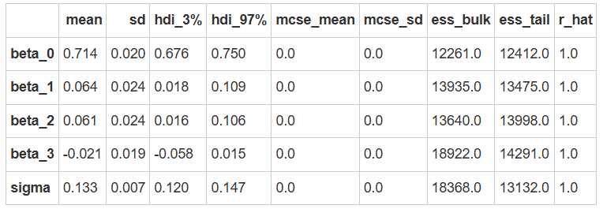

# 模型二：2×3的多元线性回归模型：无交互

- 模型一仅考虑了“Label”对模型的影响。然而，反应时间可能不仅受到标签的影响，还可能受到匹配水平(matching)的影响。因此，第二个研究问题是：**“匹配条件是否会影响反应时间？”**。

- 如果把“matching”条件加入到模型中，会不会让模型更好？我们来看看如何建立模型二:

## 哑变量编码规则

模型二加入了新的自变量“Matching”（matching， non-matching），我们先不考虑两个自变量之间的交互作用，即“Label”和“Matching”是独立的影响因素。在新的模型中，“Label”是一个三水平因子（Self、Friend、Stranger），而“Matching”是一个二水平因子（matching、non-matching）。

- Label（self，friend，stranger）

- Matching（matching，non-matching）

**模型设计与编码规则**

Label（三水平因子）：采用treatment编码，将self作为基线，生成两个对比列：

- contrast1：friend vs self

- contrast2：stranger vs self

Matching（二水平因子）：采用treatment编码，将“matching”作为基线，生成一个对比列：

contrast3：matching vs non-matching

<style>
.center 
{
  width: auto;
  display: table;
  margin-left: auto;
  margin-right: auto;
}
</style>
<div class="center">

|Label|Matching|截距（baseline）|contrast1（friend vs self）|contrast2（stranger vs self）|contrast3（matching vs non-matching）|
| :-----------: | :-----------: | :-----------: | :-----------: | :-----------: | :-----------: |
|self|matching|1|0|0|0|
|friend|matching|1|1|0|0|
|stranger|matching|1|0|1|0|
|self|non-matching|1|0|0|1|
|friend|non-matching|1|1|0|1|
|stranger|non-matching|1|0|1|1|
</div>

在模型二中，两个分类自变量X（Label：Self, Friend, Stranger） 和 M（Matching：matching, nonmatching ）的关系可以表示为：

$$
Y=\beta_0+\beta_1·X_1+\beta_2·X_2+\beta_3·M_1+\epsilon_i
$$

通过Treatment 编码：

- $\beta_0$：表示基准条件（Self-matching）的均值

- $\beta_1$：Friend 条件相对于 Self 条件的均值差异（在 matching 条件下）

- $\beta_2$：Stranger 条件相对于 Self 条件的均值差异（在 matching 条件下）

- $\beta_3$：nonmatching 条件相对于 matching 条件的均值差异

在此基础上，我们需要对$\beta_3$设置先验分布：

$$
\beta_3 \sim N(0,1^2)
$$

完整模型设定:

$$
Y_i | \beta_0,\beta_1\,\beta_2,\beta_3,\sigma \sim N(\mu_i,\sigma^2)\\
\mu_i=\beta_0+\beta_1·X_1+\beta_2·X_2+\beta_3·M_1
$$

***- 需要注意：先验分布的单位是秒（s），因此数据集里的RT也需要用相同的单位！***


## 模型拟合和推断

我们可以通过 PyMC 构建该模型，并使用 MCMC 算法进行采样

```python
# 转换分类变量为哑变量
X1 = (df['Label'] == 'Friend').astype(int)
X2 = (df['Label'] == 'Stranger').astype(int)

# Matching 条件的哑变量
Matching = (df['Matching'] == 'matching').astype(int)
```

```python
import pymc as pm

with pm.Model() as model2:
    # 先验分布
    beta_0 = pm.Normal('beta_0', mu=5, sigma=2)  # 截距
    beta_1 = pm.Normal('beta_1', mu=0, sigma=1)  # Friend 的主效应
    beta_2 = pm.Normal('beta_2', mu=0, sigma=1)  # Stranger 的主效应
    beta_3 = pm.Normal('beta_3', mu=0, sigma=1)  # Matching 的主效应
    sigma = pm.Exponential('sigma', lam=0.3)  # 误差项的标准差
    
    # 线性模型
    mu = beta_0 + beta_1 * X1 + beta_2 * X2 + beta_3 * Matching
    
    # 观测数据的似然函数
    likelihood = pm.Normal('Y_obs', mu=mu, sigma=sigma, observed=df['RT_sec'])
```

**进行后验采样**

接下来我们使用`pm.sample()`进行mcmc采样

```python
with model2:
    model2_trace = pm.sample(draws=5000,                   # 使用mcmc方法进行采样，draws为采样次数
                      tune=1000,                    # tune为调整采样策略的次数，可以决定这些结果是否要被保留
                      chains=4,                     # 链数
                      discard_tuned_samples=True,  # tune的结果将在采样结束后被丢弃
                      random_seed=84735)           # 后验采样
```

**MCMC诊断和后验推断**

我们可以使用`az.summary`函数来查看诊断和后验推断的摘要。

```python
az.summary(model2_trace)
```


使用 ROPE+HDI 对参数进行检验，可以看到$\beta_3$非常接近0，表明该参数没有显著性。

```python
# 定义 ROPE 区间，根据研究的需要指定实际等效范围
rope_interval = [-0.05, 0.05]

# 绘制后验分布，显示 HDI 和 ROPE
az.plot_posterior(
    model2_trace,
    var_names=["beta_1", "beta_2", "beta_3"],
    hdi_prob=0.95,
    rope=rope_interval,
    figsize=(12, 3),
    textsize=12
)

plt.show()
```


- 使用贝叶斯因子进行差异检验:

```python
# 进行贝叶斯因子计算，需要采样先验分布
with model2:
    model2_trace.extend(pm.sample_prior_predictive(5000, random_seed=84735) )

fig, axes = plt.subplots(1,3, figsize=(12, 3.5))

# 绘制贝叶斯因子图
# beta1
ax = axes[0]
az.plot_bf(model2_trace, var_name="beta_1", ref_val=0, ax=ax)
ax.set_xlim(-0.5, 0.5) 
# beta2
ax = axes[1]
az.plot_bf(model2_trace, var_name="beta_2", ref_val=0, ax=ax)
ax.set_xlim(-0.5, 0.5) 
# beta3
ax = axes[2]
az.plot_bf(model2_trace, var_name="beta_3", ref_val=0, ax=ax)
ax.set_xlim(-0.5, 0.5) 

# 去除上框线和右框线
sns.despine()
plt.show()
```


我们可以看到，$\beta_3的BF_{01}$接近30，表明有较强的证据说明不同匹配条件下Y的均值相同。

**后验预测**

最后，我们可以使用`pm.sample_posterior_predictive`函数来生成后验预测。

并通过`az.plot_ppc`函数来绘制后验预测的基本结果。

```python
with model2:
    model2_ppc = pm.sample_posterior_predictive(model2_trace, random_seed=84735)
az.plot_ppc(model2_ppc, num_pp_samples = 500)
```


```python
import xarray as xr

# 导入真实的自变量
X1 = xr.DataArray((df['Label'] == 'Friend').astype(int))
X2 = xr.DataArray((df['Label'] == 'Stranger').astype(int))
Matching = xr.DataArray((df['Matching'] == 'matching').astype(int))

model2_trace.posterior["y_model"] = model2_trace.posterior["beta_0"] + model2_trace.posterior["beta_1"] * X1 + model2_trace.posterior["beta_2"] * X2 + model2_trace.posterior["beta_3"] * Matching

df["model2_prediction"] = model2_trace.posterior.y_model.mean(dim=["chain","draw"]).values
```

```python
fig, axes = plt.subplots(1, 2, figsize=(8, 4))

# 在第一个子图上绘制 Model 1 的预测结果
plot_prediction(df, predicted_y="model1_prediction", ax=axes[0])
axes[0].set_title("Model 1")

# 在第二个子图上绘制 Model 2 的预测结果
plot_prediction(df, predicted_y="model2_prediction", ax=axes[1])
axes[1].set_title("Model 2")

# 显示图形
sns.despine()
plt.tight_layout()
plt.show()
```


从模型预测结果来看：

- 模型1中，不同匹配条件下的反应时预测相同；但在模型2中，不同匹配条件下的反应时预测不同，说明匹配条件对反应时存在影响。

我们仔细观察模型1和模型2的自我条件，会发现Model2的预测值更贴合均值。但是总的来看，无论是模型1还是模型2，预测值与实际值的拟合程度仍然没有得到很好的提升。

- **这是因为没有考虑标签“Label”和匹配条件“Matching”的交互作用**