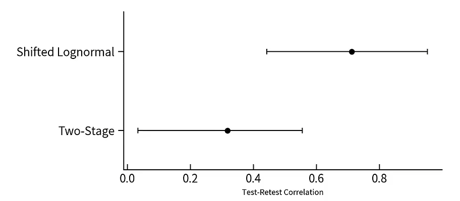

# Part 2: Three examples

## 1、例1 —— 社会关系地位与幸福感的关系
<font size=3>

&emsp;&emsp;实例的数据来自 Many Labs 2 项目中的一个研究。

&emsp;&emsp;该研究探究了社会关系地位对于幸福感的影响 “Sociometric status and well-being”， (Anderson, Kraus, Galinsky, & Keltner, 2012)。

&emsp;&emsp;该数据集包括6905个被试的数据。

参考文献：

Anderson, C., Kraus, M. W., Galinsky, A. D., & Keltner, D. (2012). The local-ladder effect: Social status and subjective well-being. Psychological Science, 23(7), 764-771. https://doi.org/10.1177/0956797611434537

In [1]:
```python
import arviz as az
from scipy.stats import levene
from pingouin import ttest, tost, bayesfactor_ttest
import matplotlib.pyplot as plt
import numpy as np
import pandas as pd
import pymc as pm
import xarray as xr
import pytensor.tensor as pt
import scipy.stats as stats
import seaborn as sns
from pytensor.tensor import TensorVariable
from scipy.stats import pearsonr
import graphviz
from graphviz import Digraph

# 设置随机种子
rng = np.random.default_rng(202409)

# 设置APA 7的画图样式
plt.rcParams.update({
    'figure.figsize': (4, 3),      # 设置画布大小
    'font.size': 12,               # 设置字体大小
    'axes.titlesize': 12,          # 标题字体大小
    'axes.labelsize': 12,          # 轴标签字体大小
    'xtick.labelsize': 12,         # x轴刻度字体大小
    'ytick.labelsize': 12,         # y轴刻度字体大小
    'lines.linewidth': 1,          # 线宽
    'axes.linewidth': 1,           # 轴线宽度
    'axes.edgecolor': 'black',     # 设置轴线颜色为黑色
    'axes.facecolor': 'white',     # 轴背景颜色（白色）
    'xtick.direction': 'in',       # x轴刻度线向内
    'ytick.direction': 'out',      # y轴刻度线向内和向外
    'xtick.major.size': 6,         # x轴主刻度线长度
    'ytick.major.size': 6,         # y轴主刻度线长度
    'xtick.minor.size': 4,         # x轴次刻度线长度（如果启用次刻度线）
    'ytick.minor.size': 4,         # y轴次刻度线长度（如果启用次刻度线）
    'xtick.major.width': 1,        # x轴主刻度线宽度
    'ytick.major.width': 1,        # y轴主刻度线宽度
    'xtick.minor.width': 0.5,      # x轴次刻度线宽度（如果启用次刻度线）
    'ytick.minor.width': 0.5,      # y轴次刻度线宽度（如果启用次刻度线）
    'ytick.labelleft': True,       # y轴标签左侧显示
    'ytick.labelright': False      # 禁用y轴标签右侧显示
})
```

In [2]:
```python
# 导入数据, 注意在和鲸和在自己电脑（本地）时有差异）
try:
  SMS_data = pd.read_csv('/home/mw/input/bayes3797/SMS_Well_being.csv')
except:
  SMS_data = pd.read_csv('data/SMS_Well_being.csv')
# 选择需要的列
SMS_data = SMS_data[['uID','variable','factor','Country']]
# 查看数据
SMS_data.head(2)
```

In [3]:
```python
# 把数据分为高低两种社会关系的地位的子数据以便画图与后续分析
factor_high = [sorted(SMS_data.query('factor=="High"').variable.loc[0:3000])]
factor_low = [sorted(SMS_data.query('factor=="Low"').variable.loc[0:3000])]
```

- 通过画图可视化两种社会关系地位对幸福感的影响

&emsp;&emsp;图中横坐标代表高低两种社会关系地位，纵坐标代表了主观幸福感评分。

In [4]:
```python
# 定义绘图函数
def adjacent_values(vals, q1, q3):
    upper_adjacent_value = q3 + (q3 - q1) * 1.5
    upper_adjacent_value = np.clip(upper_adjacent_value, q3, vals[-1])

    lower_adjacent_value = q1 - (q3 - q1) * 1.5
    lower_adjacent_value = np.clip(lower_adjacent_value, vals[0], q1)
    return lower_adjacent_value, upper_adjacent_value

def set_axis_style(ax, labels):
    ax.xaxis.set_tick_params(direction='out')
    ax.xaxis.set_ticks_position('bottom')
    ax.set_xticks(np.arange(1, len(labels) + 1), labels=labels)
    ax.set_xlim(0.25, len(labels) + 0.75)
    ax.set_xlabel('Soceity Status')

def plot_violin_apa7(data, x_labels, y_label, title=None):
    
    fig, ax = plt.subplots(figsize=(6, 4))  # 调整图形大小

    # 创建小提琴图
    parts = ax.violinplot(data, showmeans=False, showmedians=False, showextrema=False)

    # 设置小提琴图的样式
    for pc in parts['bodies']:
        pc.set_facecolor('#D43F3A')
        pc.set_edgecolor('black')
        pc.set_alpha(0.8)

    # 计算分位数和须
    quartile1, medians, quartile3 = np.percentile(data, [25, 50, 75], axis=1)
    whiskers = np.array([adjacent_values(sorted_array, q1, q3)
                         for sorted_array, q1, q3 in zip(data, quartile1, quartile3)])

    whiskers_min, whiskers_max = whiskers[:, 0], whiskers[:, 1]

    # 绘制中位数和须
    inds = np.arange(1, len(medians) + 1)
    ax.scatter(inds, medians, marker='o', color='white', s=30, zorder=3)
    ax.vlines(inds, quartile1, quartile3, color='k', linestyle='-', lw=5)
    ax.vlines(inds, whiskers_min, whiskers_max, color='k', linestyle='-', lw=1)

    # 设置x轴和y轴标签
    ax.set_xticks(np.arange(1, len(x_labels) + 1))
    ax.set_xticklabels(x_labels)
    ax.set_ylabel(y_label)

    # 设置y轴从0开始
    ax.set_ylim(0, None)

    # 保留左侧和底部的框线，移除右侧和顶部的框线
    ax.spines['bottom'].set_visible(True)
    ax.spines['left'].set_visible(True)
    ax.spines['bottom'].set_linewidth(1)
    ax.spines['left'].set_linewidth(1)

    ax.spines['top'].set_visible(False)
    ax.spines['right'].set_visible(False)

    # 如果有标题，则设置标题
    if title:
        ax.set_title(title, pad=10)

    # 设置x轴风格
    set_axis_style(ax, x_labels)

    # 图形的显示
    plt.tight_layout()
    plt.show()
```

In [5]:
```python
# 示例数据和函数调用
plot_data = [np.random.normal(70, 10, 100), np.random.normal(60, 15, 100)]
plot_violin_apa7(plot_data, ['Low', 'High'], 'Well-being',
                 'The impact of social status on well-being')

```
- 通过t检验，分析两种社会关系地位下幸福感的差异

In [6]:
```python
# levene检验
levene_stat, levene_p = levene(SMS_data['variable'][SMS_data['factor'] == 'High'], 
                               SMS_data['variable'][SMS_data['factor'] == 'Low'])
print(f'Levene Test p-value: {levene_p}')
```

- 根据独立样本t检验结果，低社会地位组（M = 0.014, SD = 0.66）和高社会地位组（M = -0.014, SD = 0.67）之间的差异在统计学上不显著，t = 1.76, **p = 0.079**。

- 这意味着**我们无法在传统显著性水平（α = 0.05）下拒绝原假设(H0)**。因此高社会地位和低社会地位下的幸福感差异在统计学上不是显著的。

 In [7]:
 ```python
SMS_low = SMS_data.query('factor=="Low"').variable.values
SMS_high = SMS_data.query('factor=="High"').variable.values
print(
    f"Low Social Status：{np.around(np.mean(SMS_low),3)} ± {np.around(np.std(SMS_low),2)}；",
    f"High Social Status：{np.around(np.mean(SMS_high),3)} ± {np.around(np.std(SMS_high),2)}")

# 进行独立样本t检验  
results = stats.ttest_ind(
    a= SMS_low,
    b= SMS_high, 
    equal_var=True)
print(f"t={round(results[0],2)}, p={round(results[1],3)}")
 ```

**<font size=5>[Two one-sided tests (TOST)检验](https://aaroncaldwell.us/TOSTERpkg/)</font>**
 
&emsp;&emsp;这是一种常用于等效性检验(equivalence tests)的方法，其目的是评估两个组之间的差异是否可以被视为“相等”。在该方法中，等效性被定义为组间差异位于预先设定的“等效边界”范围内。如果组间的差异落在这一范围内，则可以认为这两个组在统计上是等效的。

&emsp;&emsp;在本例中，我们可以将等效边界设定为0.2（bound=0.2），意味着如果两个组之间的差异不超过0.2，就可以认为它们是等效的。

&emsp;&emsp;因此，检验得出的p值（2.265256e-27）可以表明有非常强的证据表明这两个组之间的差异在等效边界之内。

In [8]:
```python
# 双单侧检验（Two one-side test, TOST）
tost_res = tost(x=SMS_data['variable'][SMS_data['factor'] == 'High'], 
                y=SMS_data['variable'][SMS_data['factor'] == 'Low'], 
                bound=0.20, paired=False) # 将等效边界值设为0.2
print(tost_res)
```

- <font size=5>**通过贝叶斯因子替代t检验**</font>

&emsp;&emsp;传统的零假设显著性检验（Null hypothesis significance test, NHST）的框架之下，t检验只提供了一个二分的结果：拒绝或者无法拒绝H0。但 *p* = 0.079这样的结果无法支持H0。

&emsp;&emsp;**而贝叶斯因子（Bayes Factor, BF）方法可以提供一种更直观和渐进的方式来评估数据支持原假设（无效假设，H0）还是备择假设(H1)。**

In [9]:
```python
# 贝叶斯因子
## 比较高低社会关系地位的社会关系的效应
ttest_res = ttest(SMS_data['variable'][SMS_data['factor'] == 'High'], 
                     SMS_data['variable'][SMS_data['factor'] == 'Low'], 
                     paired=False)

## 计算贝叶斯因子
t_value = ttest_res['T'].values[0] # 提取t值
dof = ttest_res['dof'].values[0] # 提取自由度

# 计算‘High’组和‘Low’组的样本量大小
sample_size_high = len(SMS_data['variable'][SMS_data['factor'] == 'High'])
sample_size_low = len(SMS_data['variable'][SMS_data['factor'] == 'Low'])

# 使用默认的r值= 0.707
BF_sms = bayesfactor_ttest(t_value, nx=sample_size_high, ny=sample_size_low, paired=False, r=0.707)

# 输出贝叶斯因子
print(BF_sms)
```

&emsp;&emsp;贝叶斯因子为BF10= 0.127，或者BF01= 1/0.127 = 7.87，这表明对于**当前数据支持零假设H0**，说明高低社会关系地位组之间的社会关系效应没有显著差异。

&emsp;&emsp;下面为贝叶斯因子（Bayes Factor，BF）的解释标准
<center></center>
参考文献：

[胡传鹏, 孔祥祯, Wagenmakers, E.-J., Ly, A., 彭凯平 (2018). 贝叶斯因子及其在JASP中的实现. 心理科学进展, 26(6), 951-965.](https://journal.psych.ac.cn/xlkxjz/CN/10.3724/SP.J.1042.2018.00951)

[Wagenmakers, E.-J., & Brown, S. (2007). On the linear relation between the mean and the standard deviation of a response time distribution. Psychological Review, 114(3), 830-841. https://doi.org/10.1037/0033-295X.114.3.830](https://psycnet.apa.org/record/2007-10421-012)

In [10]:
```python
# 敏感性分析
# Cauchy (0, 1)
BF_sms_1 = bayesfactor_ttest(t_value, nx=sample_size_high, ny=sample_size_low, paired=False, r=1)
print(BF_sms_1)
```

- <font size=5>**贝叶斯推断**</font>

&emsp;&emsp;这个模型是怎么来的呢？

&emsp;&emsp;一个简单的线性模型：

&emsp;&emsp;1、通过建立线性模型去替代原本的t检验模型<br>
&emsp;&emsp;2、通过PyMC对后验进行采样<br>
&emsp;&emsp;3、通过Arviz对结果进行展示，辅助统计推断

In [11]:
```python
# 通过pymc建立基于贝叶斯的线性模型
x = pd.factorize(SMS_data.factor)[0] # high为0，low为1
# 设置beta1的先验分布的尺度参数，与r=0.707相匹配
beta1_scale = 0.707

# 建立模型
with pm.Model() as linear_regression:
    sigma = pm.HalfCauchy("sigma", beta=2)
    beta0 = pm.Normal("beta0", 0, sigma=5)
    beta1 = pm.Normal("beta1", 0, sigma=beta1_scale)
    # beta1 = pm.StudentT("beta1", nu=1, mu=0, sigma=beta1_scale)  # 使用 StudentT 分布接近 Cauchy 分布
    # beta1 = pm.Cauchy("beta1", alpha=0, beta=beta1_scale)  # 使用 Cauchy 分布，参数 beta 与 r 值对应
    x = pm.Data("x", x)
    mu = pm.Deterministic("μ", beta0 + beta1 * x)
    pm.Normal("y", mu=mu, sigma=sigma, observed=SMS_data.variable)
```
- 可以通过PyMC自带的可视化工具将模型关系可视化:

&emsp;&emsp;x为自变量，其中1为低社会关系，0为高社会关系。

&emsp;&emsp;参数β0是线性模型的截距，而β1是斜率。

&emsp;&emsp;截距代表了高社会关系地位被试的幸福感，而截距加上斜率表示低社会关系地位被试的幸福感。

&emsp;&emsp;参数 σ是残差，因变量y即主观幸福感。

&emsp;&emsp;模型图展示了各参数通过怎样的关系影响到因变量。

In [12]:
```python
pm.model_to_graphviz(linear_regression)
```

&emsp;&emsp;PyMC贝叶斯模型结合Arviz计算得到的贝叶斯因子结果(基于Savage-Dickey方法)与贝叶斯t-test结果接近。

In [13]:
```python
# 模型拟合过程 (mcmc采样过程)
with linear_regression:
    # 先验采样
    prior_checks = pm.sample_prior_predictive(samples=5000)
    # 后验采样
    idata = pm.sample(2000, tune=1000, target_accept=0.9, return_inferencedata=True)
    # 将先验采样的结果合并到推断数据中
    idata.extend(pm.sample_prior_predictive(samples=500, model=linear_regression))
```

In [14]:
```python
fig, axs = plt.subplots(1, 2, figsize=(6, 3))
az.plot_posterior(prior_checks.prior["beta1"], ax=axs[0])
axs[0].set_title("Prior")
az.plot_posterior(idata.posterior["beta1"], ax=axs[1], color="C1")
axs[1].set_title("Posterior")
plt.show()
```

In [15]:
```python
print(f"The Bayes T-test is {BF_sms}")
ax = az.plot_bf(idata, var_name="beta1", ref_val=0)
ax[1].set_xlim(-0.5, 0.5)
ax[1].set_xlabel("beta1 \n(represents the difference \nbetween two groups)")
plt.show()
```
<br>

## 2、例2 —— 贝叶斯分层模型（Hierarchical/Multi-level Model） 可以更准确地估计信度

&emsp;&emsp;在前面的内容中，我们通过社会关系地位（高与低）对幸福感的影响进行了可视化，并使用贝叶斯因子和贝叶斯推断对模型进行了进一步的分析。<br>
&emsp;&emsp;现实世界的数据往往存在分层结构（例如，数据可能来自不同的群体、地区、时间段等），如何更好地处理数据内在的层次结构，更加准确地估计出感兴趣的效应（如社会关系地位对幸福感的影响），正是分层模型所能解决的。

- <font size=4>**分层模型（Hierarchical Model）的特殊运用： 信度估计**</font>

&emsp;&emsp;例2的数据来源于Haines (2020)的论文（ https://osf.io/preprints/psyarxiv/xr7y3 ）。

- **<font color=#FF8C00>本文的研究问题是：认知任务作为测量个体差异的工具，是否真的信度很差？</font>**

参考文献：
[Haines, N., Kvam, P. D., Irving, L. H., Smith, C., Beauchaine, T. P., Pitt, M., & Turner, B. (2020, August 24). Theoretically informed generative models can advance the psychological and brain sciences: Lessons from the reliability paradox. PsyArXiv. https://doi.org/10.31234/osf.io/xr7y3](https://osf.io/preprints/psyarxiv/xr7y3)

&emsp;&emsp;例2数据集包括Flanker任务中的反应时间（RT）和正确率数据。Flanker任务要求被试对中央箭头的方向作出反应，同时忽略周围的干扰箭头。

```
•	反应时间 (RT)：以秒为单位，记录每次试验的反应时间。    
•	正确率 (Correct)：记录被试反应是否正确。    
•	条件 (Condition)：任务分为一致性和不一致性试验，箭头方向是否一致会影响被试的反应时间。    
•	试验和区块：任务分为多个区块，每个区块包含一系列试验。 
```
<center></center>
(Kim et al., 2022)

<br>
<br>
In [16]:

```python
# 导入例2数据
try:
  df_flanker = pd.read_csv('/home/mw/input/bayes3797/flanker_1.csv')
except:
  df_flanker = pd.read_csv('data/flanker_1.csv')

# 分层模型数据预处理
df_model = df_flanker.copy()
df_model = df_model[(df_model.RT > 0) & (df_model.Condition != 1)].reset_index(drop=True)
# 将条件进行重新编码，1为不一致，0为一致
df_model["Condition"] = np.where(df_model["Condition"] == 2, 1,df_model["Condition"])
# 将时间变量进行重新编码
df_model["Time"].replace(1, 0, inplace=True)
df_model["Time"].replace(2, 1, inplace=True)
# 生成所有试次的索引
df_model["trial_idx"] = range(len(df_model))
# 重新编码被试编号
df_model['subj_num'] = df_model['subj_num'] - 1
# 每个被试不同时间rt的最小值
rt_min = df_model.groupby(['subj_num','Time']).RT.min().unstack().to_numpy()
```

In [17]:
```python
df_model.head()
```

- <font size=4> **传统方法：初测-重测的相关系数(Two-stage model)**</font>

In[18]:
```python
# two-stage model 数据预处理

df_trad = df_flanker.copy()
# 选择反应时大于0且条件不为1
df_trad = df_trad[(df_trad.RT > 0) & (df_trad.Condition != 1)].reset_index(drop=True)
# 将条件进行重新编码，2为不一致，0为一致
df_trad["Condition"] = df_trad["Condition"].replace({2: 'incon', 0: 'con'})
# 将时间变量进行重新编码
df_trad["Time"] = df_trad["Time"].replace({1: 't1', 2: 't2'})
# 根据条件分组
df_trad = df_trad.groupby(['subj_num','Condition','Time'])['RT'].agg(['mean','std']).reset_index()
# 将需要做相关的转成长数据
df_trad= df_trad.pivot(index='subj_num',columns=['Condition','Time'],values=['mean','std']).reset_index()
df_trad.columns = [
    'subj_num' if col1 == 'subj_num' else f'{col1}_{col2}_{col3}' 
    for col1, col2, col3 in df_trad.columns]
# 关注平均值、标准差的差值
df_trad['mean_contrast_t1'] = df_trad['mean_con_t1'] - df_trad['mean_incon_t1']
df_trad['mean_contrast_t2'] = df_trad['mean_con_t2'] - df_trad['mean_incon_t2']
df_trad['sd_contrast_t1'] = df_trad['std_con_t1'] - df_trad['std_incon_t1']
df_trad['sd_contrast_t2'] = df_trad['std_con_t2'] - df_trad['std_incon_t2']
df_trad = df_trad[['subj_num','mean_contrast_t1','mean_contrast_t2','sd_contrast_t1','sd_contrast_t2']]
```
<br>

In [19]:
```python
# 经过数据预处理后，定义函数，计算time 1和time 2数据的皮尔逊相关系数
def pearson_df(method, var, col1, col2): # 定义函数，用于计算皮尔逊相关系数
    contrast_cor = pearsonr(col1, col2) # 计算皮尔逊相关系数
    contrast_coef = contrast_cor[0]
    ci_low, ci_high = contrast_cor.confidence_interval(confidence_level=0.95) # 计算置信区间
    
    # 创建结果数据框
    result_df = pd.DataFrame({
        'mean': [contrast_coef],
        'hdi_2.5%': [ci_low],
        'hdi_97.5%': [ci_high]},
        index = [['Two-Stage'],
                [f'{method}_{var}']])

    return result_df
```

<br>

In [20]:
```python
trad_mu = pearson_df(method = "trad",  
           var = "mean", # 均值
           col1 = df_trad['mean_contrast_t1'], 
           col2 = df_trad['mean_contrast_t2']) # 两个时间点的均值对比

trad_sigma = pearson_df(method = "trad", # 传统方法
           var = "sd", 
           col1 = df_trad['sd_contrast_t1'], 
           col2 = df_trad['sd_contrast_t2'])
# 合并结果
trad_result = pd.concat([trad_mu, trad_sigma]) 
trad_result = trad_result.reset_index() # 重置索引
trad_result["level_1"] = trad_result["level_1"].replace({'trad_mean': 'mu', 'trad_sd': 'sigma'}) # 重命名列名
print(trad_result)
```

<center></center>

- 从上述结果可以看出，如果我们按照传统信度解读的标准来看的话（一个可接受的问卷通常信度在0.8以上），此处的0.32是一个很低的信度值。

- **那我们是否可以得出一个结论：Flanker任务作为一个测量人个体差异的任务而言是不靠谱的？**

从统计学来看，这个两阶段模型实际上忽略了很多数据信息。

接下来，我们看看贝叶斯分层模型是如何处理的：

- **<font size=4>贝叶斯分层模型（Hierarchical Model）**
**分层的广义线性模型: Shifted Lognormal model**</font>

&emsp;&emsp;分析逻辑：
&emsp;&emsp;贝叶斯分层模型的思路认为：一个人在两个测验上的表现都能反映出他的能力，因此需要从个体层面（subject level）估计，再进行群体层面（group level）的估计。

In [21]:
```python
def logshift_model(data):
    def shifted_lognormal(mu, sigma, loc, size=None):
        return loc + pm.LogNormal.dist(mu=mu, sigma=sigma, size=size)

    coords = {"cond": data['Condition'].unique(),
            "time": data['Time'].unique(),
            "subj": data['subj_num'].unique(),
            "trial": data['trial_idx']}


    with pm.Model(coords=coords) as model:

        rho_R_mu = pm.LKJCorr('rho_R_mu', n=2, eta=1)
        rho_R_sigma = pm.LKJCorr('rho_R_sigma', n=2, eta=1)

        ######
        triu_idx = np.triu_indices(2, k=1)
        mu_corr_upper = pt.set_subtensor(pt.zeros((2, 2))[triu_idx], rho_R_mu)
        sigma_corr_upper = pt.set_subtensor(pt.zeros((2, 2))[triu_idx], rho_R_sigma)
        R_mu = pt.eye(2) + mu_corr_upper + mu_corr_upper.T
        R_sigma = pt.eye(2) + sigma_corr_upper + sigma_corr_upper.T
        L_R_mu = pt.linalg.cholesky(R_mu)
        L_R_sigma = pt.linalg.cholesky(R_sigma)

        #####

        # Group-level parameter means
        mu_mean_base = pm.Normal('mu_mean_base',mu=0, sigma=1, dims="time")
        mu_sd_base = pm.HalfNormal('mu_sd_base', sigma=1, dims="time")

        
        sigma_mean_base = pm.Normal('sigma_mean_base', mu=0, sigma=1, dims="time")
        sigma_sd_base = pm.HalfNormal('sigma_sd_base', sigma=1, dims="time")

        mu_mean_delta = pm.Normal('mu_mean_delta', mu=0, sigma=1, dims="time")
        mu_sd_delta = pm.HalfNormal('mu_sd_delta', sigma=1, dims="time") #/*

        sigma_mean_delta = pm.Normal('sigma_mean_delta', mu=0, sigma=1, dims="time")
        sigma_sd_delta = pm.HalfNormal('sigma_sd_delta', sigma=1, dims="time") #/*

        ndt_mean = pm.Normal('ndt_mean', mu=0, sigma=1, dims="time")
        ndt_sigma = pm.Normal('ndt_sigma', mu=0, sigma=1, dims="time")

        # to make diagnol matrix/ can multiply with L_R_mu/L_R_sigma
        mu_sd_delta_re = pt.diag(mu_sd_delta)
        sigma_sd_delta_re = pt.diag(sigma_sd_delta)
        L_S_mu =  pm.Deterministic("L_S_mu",pt.dot(mu_sd_delta_re,L_R_mu))
        L_S_sigma = pm.Deterministic("L_S_sigma", pt.dot(sigma_sd_delta_re, L_R_sigma))
        
        # individual-level parameters/congruent
        mu_i_base_pr = pm.Normal('mu_i_base_pr', mu=0, sigma=1, dims=["subj","time"])
        sigma_i_base_pr = pm.Normal("sigma_i_base_pr", mu=0, sigma=1, dims=["subj","time"])
        # individual-level parameters/incongruent
        mu_i_delta_pr = pm.Normal("mu_i_delta_pr", mu=0, sigma=1, dims=["time","subj"])
        sigma_i_delta_pr = pm.Normal("sigma_i_delta_pr", mu=0, sigma=1, dims=["time","subj"])

        ndt_i_pr = pm.Normal('ndt_i_pr', mu=0, sigma=1, dims=["subj","time"])
        rv = pm.Normal.dist(0,1)
        phi = pm.logcdf(rv,ndt_mean+ndt_sigma*ndt_i_pr)
        phi = pm.math.exp(phi)
        ndt_i = pm.Deterministic('ndt_i', phi*rt_min, dims=["subj","time"])

    
        # 得到公式2的后半部分
        mu_i_delta_tilde = pm.Deterministic("mu_i_delta_tilde", pt.dot(L_S_mu, mu_i_delta_pr))
        sigma_i_delta_tilde = pm.Deterministic("sigma_i_delta_tilde", pt.dot(L_S_sigma, sigma_i_delta_pr))

        #----------------------------
        
        # mu congruent
        mu_i_base = pm.Deterministic("mu_i_base", mu_mean_base + mu_sd_base*mu_i_base_pr,dims=["subj","time"])
        # sigma congruent
        sigma_i_base = pm.Deterministic("sigma_i_base", sigma_mean_base + sigma_sd_base*sigma_i_base_pr,dims=["subj","time"])
        # congruent effect
        mu_i_effect = pm.Deterministic("mu_i_effect", mu_mean_delta + mu_i_delta_tilde.T,dims=["subj","time"])
        # sigma incongruent
        sigma_i_effect = pm.Deterministic("sigma_i_effect", sigma_mean_delta + sigma_i_delta_tilde.T,dims=["subj","time"])
        # mu incongruent
        mu_i_incon = pm.Deterministic("mu_i_incon", mu_i_base + mu_i_effect,dims=["subj","time"])
        # sigma incongruent
        sigma_i_incon = pm.Deterministic("sigma_i_incon", sigma_i_base + sigma_i_effect,dims=["subj","time"])

        mu = pm.Deterministic("mu",pm.math.stack([mu_i_base,mu_i_incon]), dims=["cond","subj","time"])
        sigma_stack = pm.Deterministic("sigma_stack",pm.math.stack([sigma_i_base,sigma_i_incon]),dims=["cond","subj","time"])
        sigma = pm.Deterministic("sigma", pm.math.exp(sigma_stack), dims=["cond","subj","time"])

        time_idx = pm.MutableData("time_idx",data.Time, dims="trial")
        subj_idx = pm.MutableData("subj_idx",data.subj_num, dims="trial")
        cond_idx = pm.MutableData("cond_idx",data.Condition, dims="trial")

        likelihood = pm.CustomDist("likelihood",
                    mu[cond_idx, subj_idx, time_idx], 
                    sigma[cond_idx, subj_idx, time_idx],
                    ndt_i[subj_idx, time_idx],
                    dist = shifted_lognormal,
                    observed=data.RT,
                    dims="trial")
                                    
        # pred = pm.Deterministic("pred", likelihood + ndt_i[subj_idx, time_idx], dims="trial")

    return model
```

<br>

In [22]:
```python
# 根据不同的方法选择不同的模型
def process_model(data, distribution):
    if distribution == 'log_shift':
        return logshift_model(data)
```

<br>

In [23]:
```python
# 进行先验预测检验并输出
def prior_predictive_check(model, samples=50, random_seed=43201):
    model_prior_check = pm.sample_prior_predictive(
        samples=samples,
        model=model,
        var_names=["mu","sigma"],
        random_seed=random_seed
    )

    fig, ax = plt.subplots(1, 2, figsize = (15,5))
    fig.suptitle("Prior predictive check")
    ax[0].set_title("mu")
    az.plot_dist(model_prior_check.prior["mu"], ax=ax[0])

    ax[1].set_title("sigma")
    az.plot_dist(model_prior_check.prior["sigma"], ax=ax[1])

    return fig
```

<br>

In [24]:
```python
# 进行采样
def model_sampling(model):
    trace = pm.sample(draws=2000,            # 使用mcmc方法进行采样，draws为采样次数
                    tune=1000,                    # tune为调整采样策略的次数，可以决定这些结果是否要被保留
                    chains=4,                     # 链数
                    cores=4,
                    discard_tuned_samples= True,  # tune的结果将在采样结束后被丢弃
                    random_seed=43201,
                    target_accept=0.8,
                    model=model)
    return trace
```

<br>

In [25]:
```python
# 对重测信度参数进行总结
def diagnostic_summary(trace, model_name):
    diagnostic = az.plot_trace(trace,
                               var_names = ["rho_R_mu", "rho_R_sigma"],
                               figsize=(15,10))
    hdi_sum = az.summary(trace, 
                        var_names =["rho_R_mu", "rho_R_sigma"],
                        hdi_prob = 0.95)
    hdi_sum = hdi_sum[["mean","hdi_2.5%","hdi_97.5%"]]

    hdi_sum.index = pd.MultiIndex.from_arrays([[f'{model_name}'] * len(hdi_sum.index), hdi_sum.index])
    return diagnostic, hdi_sum
```

<br>

In [26]:
```python
# 集合需要的结果并输出
import gc

def result_output(data, distribution, model_name):
    model = process_model(data=data, distribution=distribution)
    prior_plot = prior_predictive_check(model, samples=50, random_seed=43201)
    trace = model_sampling(model)
    diag, hdi = diagnostic_summary(trace, model_name)
    del trace
    gc.collect()
    return diag, hdi, prior_plot
```

<br>

In [27]:
```python
# 使用4核16G的计算资源，运行以下代码，需要约2小时
diag_logshift, hdi_logshift, priorplot_logshift = result_output(df_model, "log_shift","Shifted Lognormal")
```


In [28]:
```python
# 对变量名进行修改
def rename_hdi(data):
    data = data.reset_index()
    data["level_1"] = data["level_1"].replace({'rho_R_mu[0]': 'mu', 'rho_R_sigma[0]': 'sigma'})
    return data
hdi_logshift = rename_hdi(hdi_logshift)
```

<br>

In[29]:
```python
#选择mu的重测信度参数进行绘制
plot = pd.concat([trad_result, hdi_logshift])
plot = plot[plot['level_1'] == 'mu']
plot
```
<br>

In [30]:
```python
plt.figure(figsize=(6,3), dpi=150)

# 计算可信区间
ci = [plot['mean'] - plot['hdi_2.5%'], plot['hdi_97.5%'] - plot['mean']]

# 通过error bar的形式展现区间和均值
plt.errorbar(x=plot['mean'], y=plot['level_0'], xerr=ci,
                color='black', capsize=3, linestyle='None', linewidth=1,
                marker="o", markersize=5, mfc="black", mec="black")

# 调整y轴的刻度使其更集中
plt.gca().set_ylim(-0.5, len(plot['level_0']) - 0.5)  # Adjust based on your data

# 添加标题
plt.xlabel('Test-Retest Correlation', fontsize=8)

sns.despine()
```

<center></center>

- **Two-Stage model vs. Shifted Lognormal model**
与Two-Stage model相比，Shifted Lognormal model具有更高的信度。

- 因此，如果数据本身具有一个嵌套的结构，那么合适的方法选用能够估计出模型真正的参数，就像这个例子一样。


## 3、例3 —— 贝叶斯推断在认知模型中的应用

&emsp;&emsp;在实验数据的收集时，研究者往往会采集个体反应的正确率与反应时。

&emsp;&emsp;而传统分析方法并不能同时对两种数据进行分析，从而推断潜在的认知机制。比如，个体是否愿意牺牲更多的反应时间去获得一个更准确的判断。

&emsp;&emsp;**认知模型能有效的弥补这一问题，比如 drift-diffusion model, DDM ([Pan et al, 2022](https://osf.io/preprints/psyarxiv/6uzga))。**

<center></center>